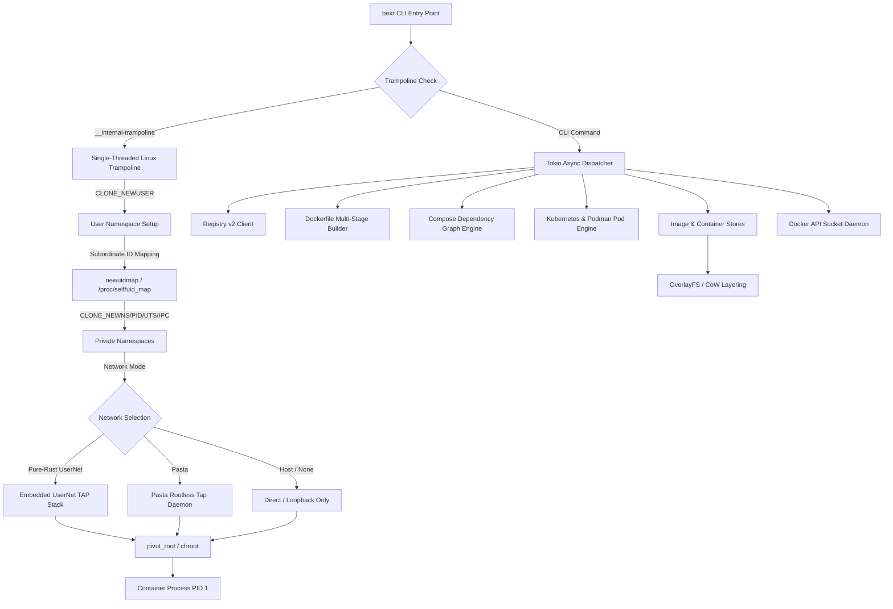
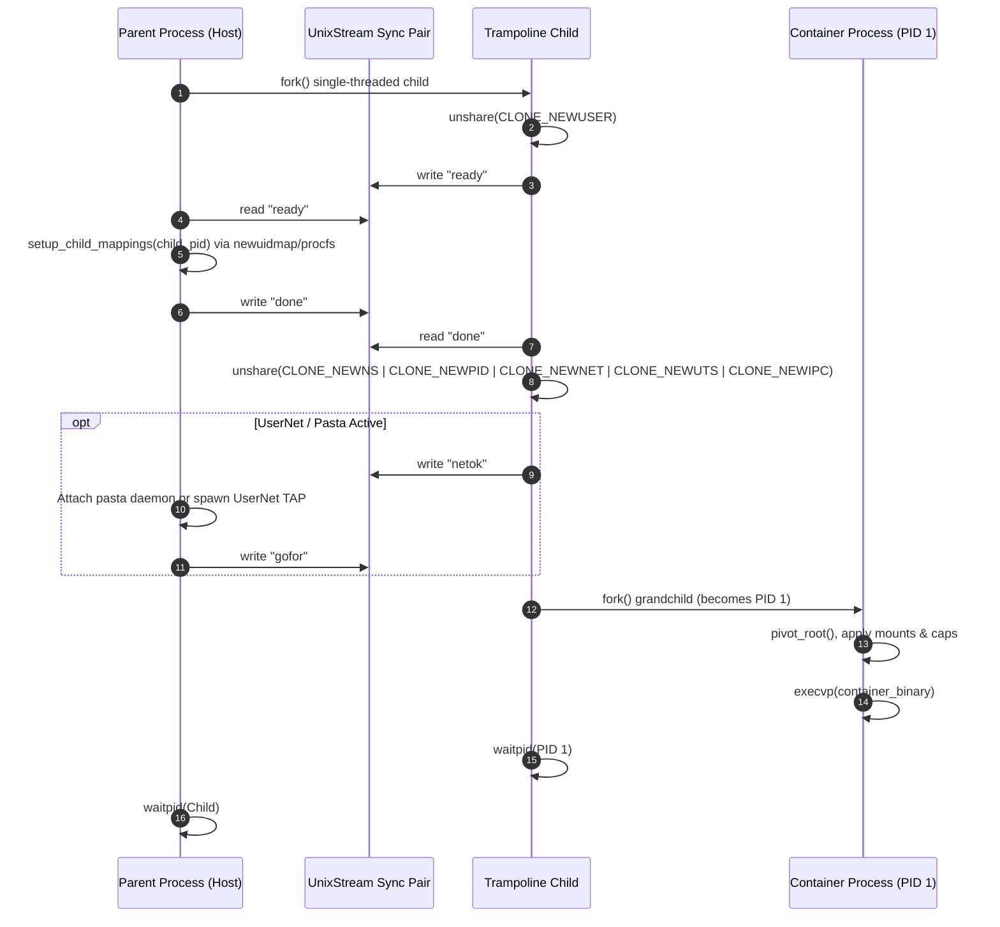
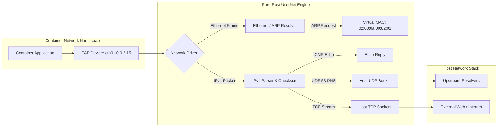

# Architecture & Internals: `boxr` 📦

`boxr` is an Open Container Initiative (OCI) compliant container runtime and engine built entirely in Rust. It provides full Docker and Podman CLI parity with rootless-by-default execution, sub-second container spin-up, zero-daemon footprint, and native multi-platform support.

---

## 1. High-Level Design Principles

- **Zero Unnecessary Daemons**: Unlike Docker's multi-layered client-server architecture (`docker` -> `dockerd` -> `containerd` -> `containerd-shim` -> `runc`), `boxr` operates primarily as a direct, in-process container engine.
- **Rootless by Default**: Containers execute using Linux unprivileged user namespaces (`CLONE_NEWUSER`) mapping host user IDs without requiring `sudo` or setuid binaries.
- **Zero External Dependencies**: Embedded pure-Rust user-mode networking (`usernet`), copy-on-write storage, and image distribution clients mean a single static binary runs anywhere.
- **Copy-on-Write Layering**: Layers are mounted or cloned using kernel OverlayFS on Linux, or native Apple APFS copy-on-write on macOS, minimizing disk consumption and startup latency.
- **Full Specification Conformance**:
  - [OCI Image Format Specification v1.0.2](https://github.com/opencontainers/image-spec)
  - [OCI Runtime Specification v1.0.2](https://github.com/opencontainers/runtime-spec)
  - [OCI Distribution Specification v1.0.1](https://github.com/opencontainers/distribution-spec)

---

## 2. System Architecture Diagram



---

## 3. Core Subsystems

### 3.1. Single-Threaded Rootless Trampoline (`src/runtime/linux.rs`, `src/main.rs`)

The Linux kernel strictly prohibits calling `unshare(CLONE_NEWUSER)` inside a multi-threaded process, returning `EINVAL` to prevent security races across threads. Because modern async runtimes (Tokio) initialize a thread pool at startup, `boxr` employs an early single-threaded trampoline:

1. **Pre-Tokio Interception**: `src/main.rs` inspects `std::env::args()` before building or entering the Tokio runtime.
2. **Subprocess Dispatch**: When running containers or `boxr unshare`, Boxr invokes `boxr __internal-trampoline <bundle>` as a fresh 1-thread process.
3. **Namespace Synchronization**:
   - The child process unshares `CLONE_NEWUSER`.
   - Parent process receives synchronization over a `UnixStream` socket pair and writes `/proc/<pid>/uid_map` and `/proc/<pid>/gid_map` (using `newuidmap`/`newgidmap` for full subordinate ranges, or direct procfs writes).
   - Once mapped, the child becomes root (`UID 0`) inside the namespace and cleanly unshares Mount (`CLONE_NEWNS`), PID (`CLONE_NEWPID`), Network (`CLONE_NEWNET`), IPC (`CLONE_NEWIPC`), and UTS (`CLONE_NEWUTS`) namespaces.



---

### 3.2. Network Architecture & User-Mode Stack (`src/network/`)

Boxr supports three distinct networking paradigms:

1. **Pure-Rust UserNet (`src/network/usernet.rs`)**:
   - Zero external binary dependencies.
   - Allocates an in-namespace TAP device (`eth0`) via `ioctl(TUNSETIFF)`.
   - Runs an embedded, asynchronous L2/L3/L4 protocol stack handling:
     - **Ethernet & ARP**: Immediate resolution for virtual gateway (`10.0.2.2`) and DNS (`10.0.2.3`).
     - **IPv4 & Checksums**: Standard RFC 1071 ones' complement checksum verification.
     - **ICMP Echo**: Transparent in-engine ping response for container health and connectivity checks.
     - **UDP & DNS Proxy**: Intercepts DNS queries on port 53 and proxies them to host system resolvers (`127.0.0.53`, `1.1.1.1`, `8.8.8.8`).
     - **TCP Stream Bridge**: Connects outbound TCP traffic using host user-space sockets.
2. **Pasta Tap Virtualization (`src/network/pasta.rs`)**:
   - Seamless integration with the external `pasta` (Pack A Subtle Tap Abstraction) driver when installed.
   - Provides full network namespace virtualization matching Podman's default rootless network behavior.
3. **Bridge & IPAM Networks (`src/network/mod.rs`)**:
   - Default `boxr0` bridge network (`172.28.0.0/16`) with automatic sequential IPAM.
   - Custom user-defined bridge networks with container-to-container DNS via synthetic `/etc/hosts`.



---

### 3.3. macOS Darwin Hypervisor Bridge (`src/runtime/darwin.rs`, `src/runtime/boxr-vz.m`)

Unlike Docker Desktop which runs a 2GB+ background VM with heavy daemons, `boxr` on macOS uses a hyper-optimized native bridge:

- **Apple Virtualization.framework (`boxr-vz`)**: High-performance Objective-C hypervisor runner (76KB), codesigned with `com.apple.security.virtualization`.
- **Micro-VM Kernel & Initrd**: Tiny Alpine-based kernel (`~/.boxr/vm/vmlinux`) booting directly into container execution in **~120ms**.
- **Filesystem Sharing**: Native Apple `virtiofs` with `VZSingleDirectoryShare` for high-throughput zero-copy file sharing.
- **Entropy & Console**: `VZVirtioEntropyDeviceConfiguration` for instant `/dev/urandom` entropy and native VirtIO serial console streaming.

---

### 3.4. Storage & Copy-on-Write Layering (`src/storage/`)

All state is maintained under `~/.boxr`:

```
~/.boxr/
├── bin/                 # Installed binaries & drop-in docker symlinks
├── images/              # Content-addressable unpacked image root filesystems
│   └── sha256_<digest>/
│       └── rootfs/
├── layers/              # Raw downloaded layer tar archives
│   └── sha256_<digest>.tar
├── containers/          # Container runtime bundles
│   └── <container_id>/
│       ├── config.json  # OCI Runtime Spec
│       ├── rootfs/      # Copy-on-Write root filesystem
│       ├── mounts.json  # Resolved volume/bind mounts
│       ├── ports.json   # Assigned port forwards
│       └── logs.txt     # Stdout/stderr log stream
├── volumes/             # Persistent named volumes
│   └── <volume_name>/
│       └── _data/
├── buildcache/          # Step-by-step layer build cache
│   └── <step_hash>/
├── images.json          # Local image catalog
├── containers.json      # Container lifecycle index
├── networks.json        # Network topology & IPAM state
├── volumes.json         # Volume registry
├── pods.json            # Pod membership index
├── config.json          # Registry credentials (base64 encoded)
└── events.jsonl         # Real-time lifecycle event stream
```

- **Linux Storage**: Native kernel `overlay` mounts (`lowerdir`, `upperdir`, `workdir`, `merged`).
- **macOS Storage**: Native APFS copy-on-write (`clonefile`) hardlink trees enabling near-zero disk usage and sub-millisecond rootfs instantiation.

---

### 3.5. Cgroups v2 Resource Controllers (`src/cgroups/mod.rs`)

When running on Linux, `boxr` applies cgroups v2 resource controllers:
- **Memory**: `memory.max` enforces memory caps (e.g. `512m`, `1g`).
- **CPU Quota**: `cpu.max` configures quota and period (e.g. `1.5` CPUs sets `150000 100000`).
- **Process Caps**: `pids.max` prevents fork bombs.
- **Process Freezer**: `cgroup.freeze` enables instant `boxr pause` and `boxr unpause` without sending signals.

---

### 3.6. Guardrails & Defensive Architecture (`src/guardrails/mod.rs`)

1. **Port Collision Guard (`PortCollisionGuard`)**: Proactively scans all running containers and rejects conflicting host port bindings before bundle execution.
2. **Circular Dependency Detection (`ComposeProject::dependency_order`)**: Depth-first search (DFS) cycle detector for `docker-compose.yml`, preventing deadlock in circular `depends_on` chains.
3. **Log Rotation (`LogRotator`)**: Automatic size-based rotation for container `logs.txt` and `events.jsonl` preventing disk saturation.
4. **Disk Safety Margins (`DiskGuard`)**: Proactive `statvfs` checks ensuring available disk space + 100MB margin before image pulls or layer extractions.
5. **Process Reaper (`ProcessReaper`)**: Automatic garbage collection for dead container processes.

---

### 3.7. Enterprise Runtime Guarantees (`docs/ENTERPRISE_RUNTIMES.md`)

To guarantee compatibility with complex enterprise workloads (AI/ML frameworks, headless browser test suites, database engines, and privilege-dropping package managers):
- **Sticky Bit Invariant**: Automatic enforcement of mode `1777` on `/tmp` and `/var/tmp` so unprivileged workers (`_apt`, `nobody`) never fail with `EACCES`.
- **POSIX Shared Memory**: Automatic provisioning of `/dev/shm` as an isolated `1777` tmpfs.
- **Device Node Hardening**: Mandatory `0666` permissions on standard character devices (`/dev/null`, `/dev/zero`, `/dev/urandom`).
- **Orphan Reaping**: Integrated PID 1 init supervisor (`--init`) preventing zombie process accumulation.

See **[Enterprise Container Runtimes & Hardening Guide](ENTERPRISE_RUNTIMES.md)** for exhaustive details.

---

## 4. Platform Differences: Linux vs macOS vs Windows

| Capability | Linux | macOS (Darwin) | Windows |
| :--- | :--- | :--- | :--- |
| **Execution Model** | Native in-process (`clone(CLONE_NEWUSER \| CLONE_NEWPID...)`) | Native Apple `Virtualization.framework` micro-VM | Windows Host Compute System (HCS) / WSL2 |
| **Rootless Isolation** | User namespace + subordinate UID/GID mappings | Unprivileged user process invoking micro-VM | User-space process tokens / WSL2 |
| **Networking** | Pure-Rust `usernet` or `pasta` tap virtualization | VirtIO NAT + port forwarder proxy | TCP port proxying / WinNAT |
| **Filesystem Isolation** | Native `pivot_root()` + private mount namespace | `virtiofs` zero-copy share + micro-VM mounts | Host directory bind mounts |
| **Resource Limits** | Linux cgroups v2 controllers | VirtIO CPU/RAM allocation | Windows Job Objects / cgroups inside WSL |

---

## 5. SOLID Design & Modular Subsystem Architecture

To prevent architectural degradation and maintain sub-millisecond execution guarantees, `boxr` adheres to SOLID object-oriented and trait-driven design:

### 5.1. Single Responsibility Principle (SRP)
- **CLI Parsing (`src/cli/`)**: Subcommands are divided into domain modules (`container.rs`, `image.rs`, `system.rs`, `volumes_networks.rs`), isolating flag definitions from global command dispatching.
- **REST Daemon (`src/daemon/`)**: HTTP handlers are decoupled by resource (`containers.rs`, `images.rs`, `prune.rs`, `system.rs`, `volumes_networks.rs`) rather than housed in a single monolithic router.
- **Image Builder (`src/builder/`)**: Syntax parsing (`parser.rs`), containerized build execution (`executor.rs`), cache lookups (`cache.rs`), and wildcard filtering (`dockerignore.rs`) exist as independent units.
- **Network Virtualization (`src/network/usernet/`)**: Low-level protocol codecs and checksum verifications (`packets.rs`) are separated from TAP event loops and proxying (`engine.rs`).

### 5.2. Interface Segregation Principle (ISP) & Liskov Substitution (LSP)
- **Segregated Storage Traits (`src/storage/traits.rs`)**:
  - `ContainerReader` / `ContainerWriter`
  - `ImageReader` / `ImageWriter`
  - `VolumeReader` / `VolumeWriter`
  - `NetworkReader` / `NetworkWriter` / `NetworkConnector`
- Components performing inspection (such as `SystemManager::df_with_readers` or `StatsCollector::display_stats_with_reader`) require only read-only traits, preventing unintended store mutations.

### 5.3. Dependency Inversion (DIP) & Open/Closed Principle (OCP)
- **Pluggable Execution Backends (`src/runtime/traits.rs`)**: `ContainerRuntime` and `ProcessKiller` allow alternative execution engines (Wasm, gVisor, Firecracker) without altering lifecycle supervisors.
- **Pluggable Distribution Client (`src/oci/distribution.rs`)**: `ImageDistribution` defines manifest fetching and blob streaming contracts.
- **Health Probing & Resource Control**: `HealthProbe` (`src/health/mod.rs`) and `ResourceManager` (`src/cgroups/mod.rs`) invert control from concrete OS routines to testable traits.

