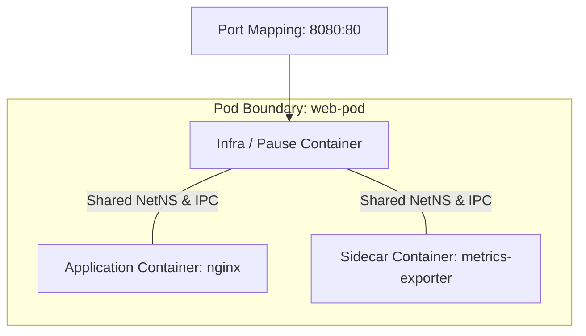

# Kubernetes & Compose Orchestration in `boxr` ☸️

`boxr` delivers native compatibility with both **Kubernetes Pod manifests** (Podman parity) and **Docker Compose** multi-service applications, eliminating the need for bulky virtual clusters (Minikube/Kind) for local testing.

---

## 1. Podman-Style Pods (`boxr pod`)

A **Pod** is a group of one or more containers that share network, IPC, and UTS namespaces, mirroring Kubernetes Pod semantics.



### Pod Lifecycle Commands
```bash
# 1. Create a pod with shared port mappings
boxr pod create --name web-pod -p 8080:80

# 2. List running and created pods
boxr pod ps

# 3. Inspect pod configuration and member containers
boxr pod inspect web-pod

# 4. Stop all containers in the pod
boxr pod stop web-pod

# 5. Start all containers in the pod
boxr pod start web-pod

# 6. Delete pod and member containers
boxr pod rm web-pod
```

---

## 2. Kubernetes Pod YAML Execution (`boxr play kube`)

You can run standard Kubernetes YAML manifests directly on your machine without running a Kubernetes cluster.

### Sample Manifest (`pod.yaml`)
```yaml
apiVersion: v1
kind: Pod
metadata:
  name: fullstack-pod
  labels:
    app: web
spec:
  containers:
    - name: web
      image: nginx:alpine
      ports:
        - containerPort: 80
          hostPort: 8080
    - name: cache
      image: redis:alpine
      ports:
        - containerPort: 6379
          hostPort: 6379
```

### Playing the Pod
```bash
boxr play kube pod.yaml
```

**What Happens Under the Hood:**
1. Boxr parses the YAML into `KubePodYaml` structures (`src/kube/mod.rs`).
2. Creates a dedicated `PodRecord` in `~/.boxr/pods.json`.
3. Sequentially provisions each container in the spec, mapping container ports and environment variables.
4. Adds the containers to the pod group and starts them.

---

## 3. Kubernetes Pod YAML Generation (`boxr generate kube`)

Export live containers or pods into standardized Kubernetes YAML for deployment into production clusters (EKS, GKE, AKS, OpenShift):

```bash
# Generate Kubernetes YAML for a single container
boxr generate kube my-container > container-pod.yaml

# Generate Kubernetes YAML for an entire pod
boxr generate kube web-pod > pod.yaml
```

### Generated Output Format
```yaml
apiVersion: v1
kind: Pod
metadata:
  name: web-pod
  labels: {}
spec:
  containers:
    - name: web
      image: nginx:latest
      ports:
        - containerPort: 80
          hostPort: 8080
```

---

## 4. Docker Compose Orchestration (`boxr compose`)

Boxr contains an embedded Compose engine supporting multi-service applications declared in `docker-compose.yml`.

### Sample `docker-compose.yml`
```yaml
version: '3.8'

services:
  web:
    image: nginx:alpine
    ports:
      - "8080:80"
    depends_on:
      - api
    networks:
      - app-net

  api:
    image: python:3.11-alpine
    command: python -m http.server 5000
    depends_on:
      - db
    networks:
      - app-net

  db:
    image: redis:alpine
    volumes:
      - redis-data:/data
    networks:
      - app-net

volumes:
  redis-data:

networks:
  app-net:
```

### Compose Lifecycle Commands
```bash
# 1. Start all services in dependency order in background
boxr compose up -d

# 2. View status of all project containers
boxr compose ps

# 3. Stream real-time logs from all services
boxr compose logs

# 4. Tear down containers, networks, and optionally volumes
boxr compose down -v
```

---

## 5. Topological Dependency Graph & Cycle Detection

### Directed Acyclic Graph (DAG) Resolution
When launching multi-service stacks, services must start in strict order. Boxr analyzes service dependencies using a depth-first search (DFS) topological sorter (`src/compose/mod.rs`):

```
db (starts 1st) ---> api (starts 2nd) ---> web (starts 3rd)
```

### Circular Dependency Guardrail
If a circular reference is introduced (e.g. `serviceA -> serviceB -> serviceA`), Boxr detects the cycle during graph parsing and aborts before creating any resources:

```
Error: Circular dependency detected in docker-compose.yml: serviceA -> serviceB -> serviceA
```
This guardrail prevents infinite loops, deadlocks, and corrupted intermediate states.
