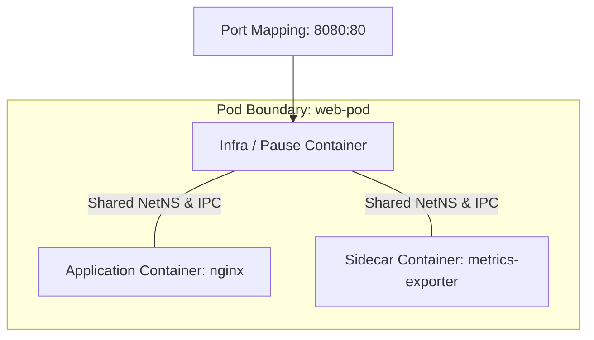

# Kubernetes & Compose Orchestration in `boxr` ☸️

`boxr` delivers native compatibility with both **Kubernetes Pod manifests** (Podman parity) and **Docker Compose** multi-service applications, eliminating the need for bulky virtual clusters (Minikube/Kind) for local testing.

---

## 1. Podman-Style Pods (`boxr pod`)

A **Pod** is a group of one or more containers that share network, IPC, and UTS namespaces, mirroring Kubernetes Pod semantics.



### Pod Lifecycle Commands
```bash
# 1. Create a pod with shared port mappings
boxr pod create --name web-pod -p 8080:80

# 2. List running and created pods
boxr pod ps

# 3. Inspect pod configuration and member containers
boxr pod inspect web-pod

# 4. Stop all containers in the pod
boxr pod stop web-pod

# 5. Start all containers in the pod
boxr pod start web-pod

# 6. Fetch aggregated logs across all pod containers
boxr pod logs -t web-pod

# 7. Clone a pod and all member containers
boxr pod clone web-pod web-pod-clone

# 8. Check pod existence
boxr pod exists web-pod

# 9. Delete pod and member containers
boxr pod rm web-pod
```

---

## 2. Kubernetes Multi-Resource YAML Execution (`boxr kube play` / `boxr play kube`)

You can run standard multi-document Kubernetes YAML manifests directly on your machine without running a Kubernetes cluster. Boxr natively supports **Pod**, **Deployment** (with replica management), **Service**, and **PersistentVolumeClaim / Volume** resources.

### Sample Multi-Resource Manifest (`deploy.yaml`)
```yaml
apiVersion: apps/v1
kind: Deployment
metadata:
  name: web-app
spec:
  replicas: 2
  template:
    spec:
      containers:
        - name: nginx
          image: nginx:alpine
          ports:
            - containerPort: 80
              hostPort: 8080
---
apiVersion: v1
kind: Service
metadata:
  name: web-service
spec:
  ports:
    - port: 80
---
apiVersion: v1
kind: PersistentVolumeClaim
metadata:
  name: app-storage
```

### Playing and Applying Resources
```bash
# Play Kubernetes resources (supports Pod, Deployment, Service, Volume/PVC)
boxr kube play deploy.yaml
# Alternatively using the legacy command:
boxr play kube deploy.yaml

# Declarative apply
boxr kube apply deploy.yaml
```

### Resource Teardown (`boxr kube down`)
Tear down all resources created by a manifest cleanly:

```bash
boxr kube down deploy.yaml
# Or via:
boxr play kube --down deploy.yaml
```

**What Happens Under the Hood:**
1. Boxr splits multi-document YAML via `serde_yaml::Deserializer`.
2. For `Deployment`, provisions `replicas` pods with indexed names (e.g. `web-app-1`, `web-app-2`).
3. For `PersistentVolumeClaim` / `Volume`, registers backing volumes in `~/.boxr/volumes.json`.
4. For `Pod`, provisions `PodRecord` and member containers in `~/.boxr/containers.json`.
5. Teardown safely stops and removes pods, containers, and named volumes.

---

## 3. Kubernetes Pod YAML Generation (`boxr kube generate` / `boxr generate kube`)

Export live containers or pods into standardized Kubernetes YAML for deployment into production clusters (EKS, GKE, AKS, OpenShift):

```bash
# Generate Kubernetes YAML for a single container
boxr kube generate my-container > container-pod.yaml
boxr generate kube my-container > container-pod.yaml

# Generate Kubernetes YAML for an entire pod
boxr kube generate web-pod > pod.yaml
boxr generate kube web-pod > pod.yaml
```

### Specgen JSON Generation (`boxr generate spec`)
In addition to Kubernetes YAML, Boxr can export container runtime state into Podman-compatible `SpecGenerator` JSON:

```bash
boxr generate spec my-container > specgen.json
```

---

## 4. Quadlet Systemd Units (`boxr quadlet`)

Boxr supports Podman **Quadlet** declarative unit files, allowing containers, Kubernetes pods, volumes, networks, and artifacts to be managed as systemd-style units:

Supported extensions:
- `.container` (Container specification)
- `.kube` (Kubernetes YAML runner)
- `.volume` (Named storage volume)
- `.network` (Container network)
- `.artifact` (OCI artifact definition)

### Quadlet Commands
```bash
# List installed Quadlet unit files in ~/.boxr/quadlets
boxr quadlet ls

# Install a Quadlet unit file
boxr quadlet install ./web.container

# Print contents of an installed unit file
boxr quadlet print web.container

# Remove an installed Quadlet file
boxr quadlet rm web.container
```

---

## 5. Docker Compose Orchestration (`boxr compose`)

Boxr contains an embedded Compose engine supporting multi-service applications declared in `docker-compose.yml`.

### Sample `docker-compose.yml`
```yaml
version: '3.8'

services:
  web:
    image: nginx:alpine
    ports:
      - "8080:80"
    depends_on:
      - api
    networks:
      - app-net

  api:
    image: python:3.11-alpine
    command: python -m http.server 5000
    depends_on:
      - db
    networks:
      - app-net

  db:
    image: redis:alpine
    volumes:
      - redis-data:/data
    networks:
      - app-net

volumes:
  redis-data:

networks:
  app-net:
```

### Compose Lifecycle Commands
```bash
# 1. Start all services in dependency order in background
boxr compose up -d

# 2. View status of all project containers
boxr compose ps

# 3. Stream real-time logs from all services
boxr compose logs

# 4. Tear down containers, networks, and optionally volumes
boxr compose down -v
```

---

## 6. Topological Dependency Graph & Cycle Detection

### Directed Acyclic Graph (DAG) Resolution
When launching multi-service stacks, services must start in strict order. Boxr analyzes service dependencies using a depth-first search (DFS) topological sorter (`src/compose/mod.rs`):

```
db (starts 1st) ---> api (starts 2nd) ---> web (starts 3rd)
```

### Circular Dependency Guardrail
If a circular reference is introduced (e.g. `serviceA -> serviceB -> serviceA`), Boxr detects the cycle during graph parsing and aborts before creating any resources:

```
Error: Circular dependency detected in docker-compose.yml: serviceA -> serviceB -> serviceA
```
This guardrail prevents infinite loops, deadlocks, and corrupted intermediate states.
