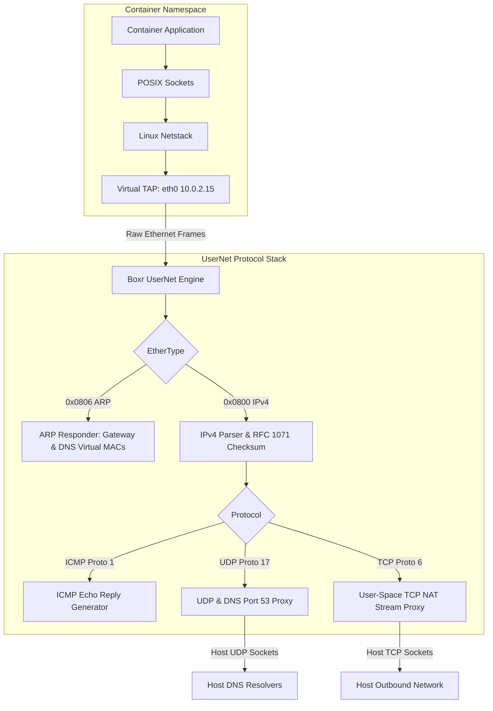
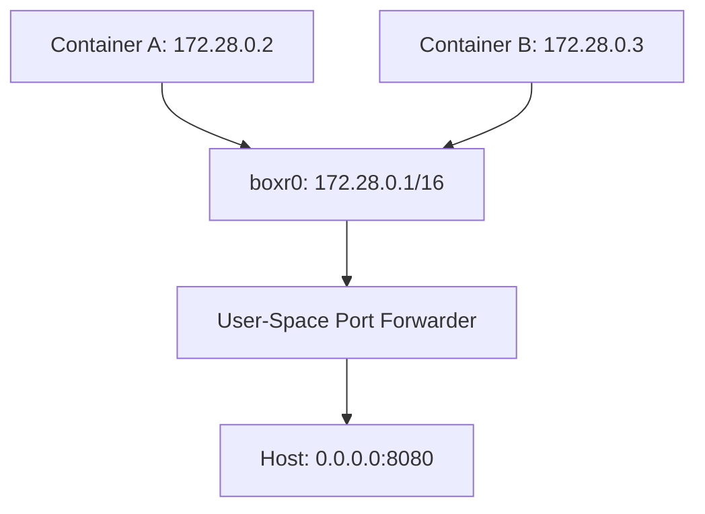

# Container Networking in `boxr` 🌐

`boxr` provides a versatile, rootless-first networking architecture designed for complete isolation, zero root privileges, and high-performance throughput.

---

## 1. Network Modes Overview

| Network Mode | Flag | Description |
| :--- | :--- | :--- |
| **Auto (Default)** | `--network auto` | Uses `pasta` if installed; otherwise automatically falls back to pure-Rust `usernet` |
| **UserNet (Pure-Rust)**| `--network usernet` | Zero-dependency embedded L2/L3/L4 user-mode network stack using TAP device |
| **Pasta** | `--network pasta` | Podman-parity user-mode tap networking via external `pasta` driver |
| **Bridge** | `--network bridge` (or `<name>`) | Virtual bridge network (`boxr0`) with IPAM and synthetic DNS |
| **Host** | `--network host` | Container shares host network namespace directly |
| **None** | `--network none` | Isolated private network namespace with only loopback (no external I/O) |

---

## 2. Pure-Rust UserNet Stack (`src/network/usernet.rs`)

When running in rootless mode without external utilities installed, `boxr` embeds a complete user-mode network protocol stack directly in the binary:



### 2.1. In-Namespace TAP Device Allocation
Because an unprivileged user has `CAP_NET_ADMIN` inside their private user namespace, Boxr opens `/dev/net/tun` and configures a TAP device:
```rust
let ifr = Ifreq {
    ifr_name: "eth0",
    ifr_flags: IFF_TAP | IFF_NO_PI,
};
ioctl(fd, TUNSETIFF, &ifr);
```

### 2.2. Protocol Engines
1. **Ethernet & ARP**:
   - Detects ARP requests from the container asking for gateway (`10.0.2.2`) or DNS (`10.0.2.3`).
   - Immediately replies with virtual gateway MAC `02:00:0a:00:02:02`.
2. **IPv4 & Checksums**:
   - Parses IPv4 headers, verifies version and IHL, and calculates standard ones' complement internet checksums.
3. **ICMP Echo**:
   - Responds to ICMP Echo Request (`ping 10.0.2.2`) with matching sequence and identifier in an ICMP Echo Reply.
4. **UDP & DNS Proxying**:
   - Intercepts UDP port 53 packets sent to `10.0.2.3` or `10.0.2.2`.
   - Forwards the DNS query over standard host `UdpSocket` to host resolvers (`127.0.0.53:53`, `1.1.1.1:53`, `8.8.8.8:53`).
   - Packages the response into valid UDP/IPv4/Ethernet frames and returns them to the container TAP device.
5. **TCP NAT Stream Proxying**:
   - Tracks active sessions: `(src_ip, src_port, dst_ip, dst_port)`.
   - Establishes unprivileged host TCP sockets to outbound destinations, streaming data bidirectionally without root rights.

---

## 3. Pasta Integration (`src/network/pasta.rs`)

`pasta` (Pack A Subtle Tap Abstraction) is the default rootless networking tool in Podman:
- When available on `$PATH`, Boxr automatically detects `pasta` and generates optimized arguments:
  ```bash
  pasta --config-net -q -I eth0 -D 1.1.1.1 -D 8.8.8.8 -t 8080:80 -u 5353:53 <child_pid>
  ```
- **Lifecycle Management**: Boxr starts `pasta` in the host namespace, attaches it to `/proc/<child_pid>/ns/net`, and terminates `pasta` when the container process exits.

---

## 4. Bridge Networks & Sequential IPAM (`src/network/mod.rs`)

Boxr includes a software bridge network manager maintaining state in `~/.boxr/networks.json`:



### 4.1. IPAM Sequence
- Subnets default to `172.28.0.0/16` for `boxr0`, and `172.X.0.0/16` for user-created networks.
- IPAM sequentially allocates host addresses starting from `.2` through `.254`.
- Gateway IP is reserved at `.1`.

### 4.2. Container Service Discovery
Containers attached to user-defined bridge networks receive synthetic `/etc/hosts` entries mapping container names to their assigned IPAM addresses:
```
127.0.0.1   localhost
172.28.0.2  web-app     3a4f891b2c3d
172.28.0.3  db-service  9b2e104f5a6b
```

---

## 5. Port Forwarding & Guardrails (`src/network/rootless.rs`)

### User-Space TCP Forwarding
When running without root privileges, Boxr binds an asynchronous TCP listener on the host port (`0.0.0.0:host_port`) and copies bidirectional streams to the target container socket (`127.0.0.1:container_port`).

### Host Port Collision Guard (`PortCollisionGuard`)
Before spinning up any container, `boxr` checks all existing running containers. If an active container already binds the same host port and protocol, Boxr aborts immediately with a clear error:
```
Error: Host port 8080 (tcp) is already bound by container 'production-web' (id: 4a2b9f)
```
