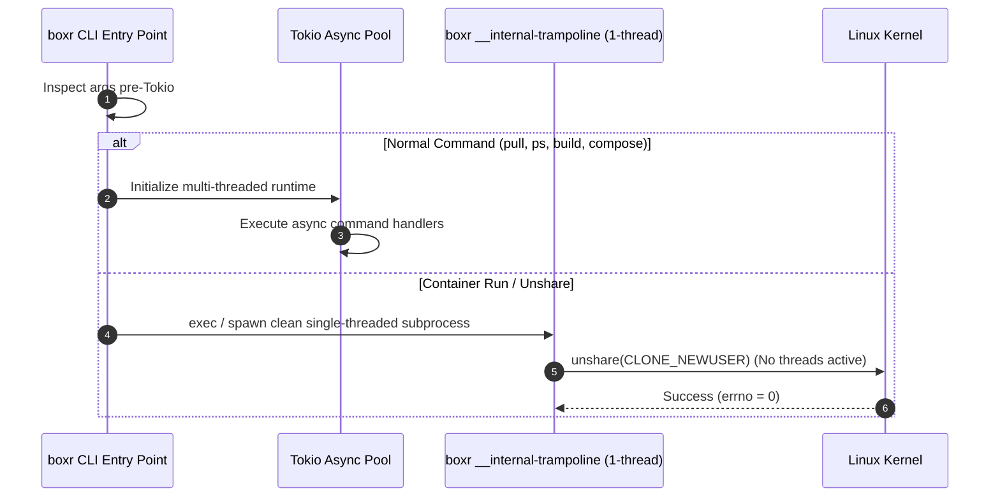

# Rootless Container Isolation in `boxr` 🔒

`boxr` is built from the ground up to be **rootless by default**. It runs containers without requiring `sudo`, root privileges, setuid helper binaries, or background system daemons.

---

## 1. The Kernel Problem: `CLONE_NEWUSER` & Multi-Threading

### The `EINVAL` Constraint
The Linux kernel explicitly restricts the `unshare(CLONE_NEWUSER)` system call:
> *If the calling process is multi-threaded, `unshare(CLONE_NEWUSER)` fails and sets `errno` to `EINVAL`.*

This restriction was introduced in the kernel to prevent security vulnerabilities where threads within the same memory space might have differing privilege boundaries during a namespace transition.

### Why Traditional Rust Runtimes Fail
Modern Rust async frameworks (such as Tokio with `#[tokio::main]`) initialize worker threads during process bootstrap. If a CLI parses arguments and calls `unshare(CLONE_NEWUSER)` from within an active Tokio runtime, the call is rejected with `EINVAL`.

### The Boxr Solution: Single-Threaded Trampoline
Boxr solves this with a pre-runtime trampoline:



`src/main.rs` checks for `__internal-trampoline`, `__internal-trampoline-exec`, or `unshare` before initializing the multi-threaded Tokio runtime. When launching a container, Boxr spawns a dedicated clean 1-thread child process that enters the user namespace cleanly.

---

## 2. Subordinate ID Mapping (`/etc/subuid` & `/etc/subgid`)

### The Mapping Model
In Linux, an unprivileged user can only map their own UID into a user namespace unless subordinate ranges are configured.

```
Container View (Inside)          Host View (Outside)
-----------------------          -------------------
UID 0 (root)             <--->   UID 1000 (user)
UID 1..65536             <--->   UID 100000..165535 (from /etc/subuid)
```

### Automatic Range Discovery
Boxr parses `/etc/subuid` and `/etc/subgid` matching either the current username or UID:

```rust
// Example subuid line:
// ubuntu:100000:65536
let sub_range = RootlessUserConfig::read_subordinate_range(false);
```

### Delegation via `newuidmap` & `newgidmap`
If `newuidmap` and `newgidmap` (setuid shadow utilities) are available on the host system:
1. The trampoline child calls `unshare(CLONE_NEWUSER)`.
2. The child sends a `"ready"` sync token to the parent over a `UnixStream` socket pair.
3. The parent invokes:
   ```bash
   newuidmap <child_pid> 0 <host_uid> 1 1 <sub_uid_start> <sub_uid_count>
   newgidmap <child_pid> 0 <host_gid> 1 1 <sub_gid_start> <sub_gid_count>
   ```
4. The parent notifies the child (`"done"`).
5. The child has full access to 65,536 mapped IDs inside the container.

### Direct Procfs Fallback
If subordinate utilities or files are absent, Boxr falls back to writing directly to `/proc/<pid>/uid_map` and `/proc/<pid>/gid_map`:
1. Writes `"deny"` to `/proc/<pid>/setgroups`.
2. Writes `"0 <host_uid> 1\n"` to `/proc/<pid>/uid_map`.
3. Writes `"0 <host_gid> 1\n"` to `/proc/<pid>/gid_map`.

---

## 3. Capabilities & Privilege Dropping

Inside the new user namespace, the container process has full capability over its own namespace, but no capabilities on the host system. Boxr applies a strict default capability whitelist based on the OCI Runtime Specification:

| Retained Capability | Purpose |
| :--- | :--- |
| `CAP_CHOWN` | Changing file ownership inside container rootfs |
| `CAP_DAC_OVERRIDE` | Bypassing file read/write permissions within rootfs |
| `CAP_FOWNER` | Bypassing permission checks on file modifications |
| `CAP_FSETID` | Preserving SUID/SGID bits |
| `CAP_KILL` | Sending signals to container child processes |
| `CAP_SETGID` | Changing group IDs inside container |
| `CAP_SETUID` | Changing user IDs inside container |
| `CAP_SETPCAP` | Setting process capability sets |
| `CAP_NET_BIND_SERVICE` | Binding to privileged ports (< 1024) in container netns |
| `CAP_SYS_CHROOT` | Invoking `chroot(2)` inside rootfs |
| `CAP_MKNOD` | Creating special files in `/dev` |

### Dropped Dangerous Capabilities
Boxr explicitly strips all host-impacting capabilities:
- `CAP_SYS_ADMIN` (no host device manipulation or raw filesystem mounting)
- `CAP_SYS_RAWIO` (no direct port/bus I/O)
- `CAP_SYS_PTRACE` (no arbitrary process debugging)
- `CAP_SYS_MODULE` (no kernel module loading)
- `CAP_SYS_BOOT` (no host reboots)

---

## 4. Seccomp Syscall Filtering

Boxr ships with an integrated default Seccomp filter profile (`src/security/mod.rs`) that returns `SCMP_ACT_ERRNO` (`EPERM`) for high-risk system calls:

- `reboot`, `kexec_load`, `kexec_file_load`
- `swapon`, `swapoff`
- `init_module`, `finit_module`, `delete_module`
- `acct`, `add_key`, `keyctl`, `request_key`
- `bpf`, `perf_event_open`
- `lookup_dcookie`, `userfaultfd`, `vmsplice`
- `settimeofday`, `stime`, `clock_settime`

---

## 5. macOS & Windows Rootless Model

- **macOS**: Since Darwin (XNU) does not implement Linux namespaces, Boxr executes rootless containers inside an Apple `Virtualization.framework` micro-VM (`boxr-vz`). The micro-VM is unprivileged and owned by the logged-in user without running root daemons or requiring sudo.
- **Windows**: Containers run unprivileged via user-space token restrictions, Job Objects, or inside isolated WSL2 lightweight utility VMs.

---

## 6. Enterprise Filesystem & Permission Invariants

In rootless execution, images are extracted by unprivileged host UIDs. To prevent service account failures when applications drop privileges (such as `apt-get` dropping to `_apt`, or `postgres` dropping to `postgres`):

1. **Sticky Bit `1777` on `/tmp` and `/var/tmp`**: Boxr automatically enforces `1777` mode at container startup to prevent `EACCES` when non-root workers create lock or temporary files.
2. **POSIX Shared Memory (`/dev/shm`)**: Boxr automatically provisions `/dev/shm` as a dedicated `1777` tmpfs (default 64MB, configurable via `--shm-size`) for AI/ML dataloaders (PyTorch) and headless browsers.
3. **Essential Device Nodes**: Character devices (`/dev/null`, `/dev/zero`, `/dev/urandom`) are provisioned with `0666` permissions so non-root processes can safely redirect I/O.

For in-depth architectural details, see the **[Enterprise Container Runtimes & Hardening Guide](ENTERPRISE_RUNTIMES.md)**.
